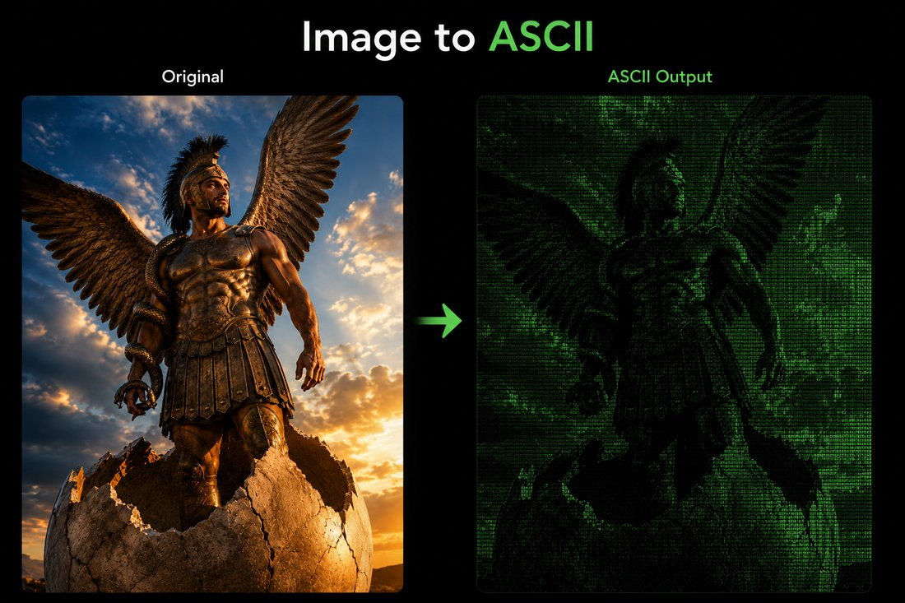

# Phanes

Phanes is a single HTML file that holds three image tools. Click a box, use the tool, click **All tools** to come back. Everything runs in your browser, so your images are processed locally and are not uploaded to a server.

**Live demo:** https://Kaklaber.github.io/Phanes/

  

## The three tools

- **Thoth — Image to ASCII** — convert an image or a live camera frame into ASCII art.
- **Tessellate — Image to HTML/CSS** — rebuild an image as a mosaic of HTML/CSS blocks.
- **Trace — Image to SVG** — trace a bitmap into clean, editable SVG paths.

## How to use

1. Open the [live demo](https://Kaklaber.github.io/Phanes/) or the downloaded `index.html`.
2. Click the tool you want.
3. Drop an image in, adjust the controls, and export. **All tools** (top left) goes back to the three boxes.

## One file

The three tools are embedded inside `index.html`, so Phanes is one file with no dependencies, no build step, and no network calls — it works offline, even from a USB stick.

## Local use

Download `index.html` and open it in a modern browser. Camera access in Thoth needs HTTPS, so that one button works best through GitHub Pages or any local server.

## Credits

Phanes was inspired by [ASCII Generator 2](https://ascgendotnet.jmsoftware.co.uk/) and the browser-based [ascgen2 project](https://github.com/benpetty/ascgen2).

## License

Phanes is available under the [MIT License](LICENSE).
